# The bashOS Desktop — a tour

Everything `bashos gui` does, scene by scene, with the real thing on screen.
For the architecture, the guard model and how to extend it, read
[DESKTOP.md](DESKTOP.md); this page is the feature reference.

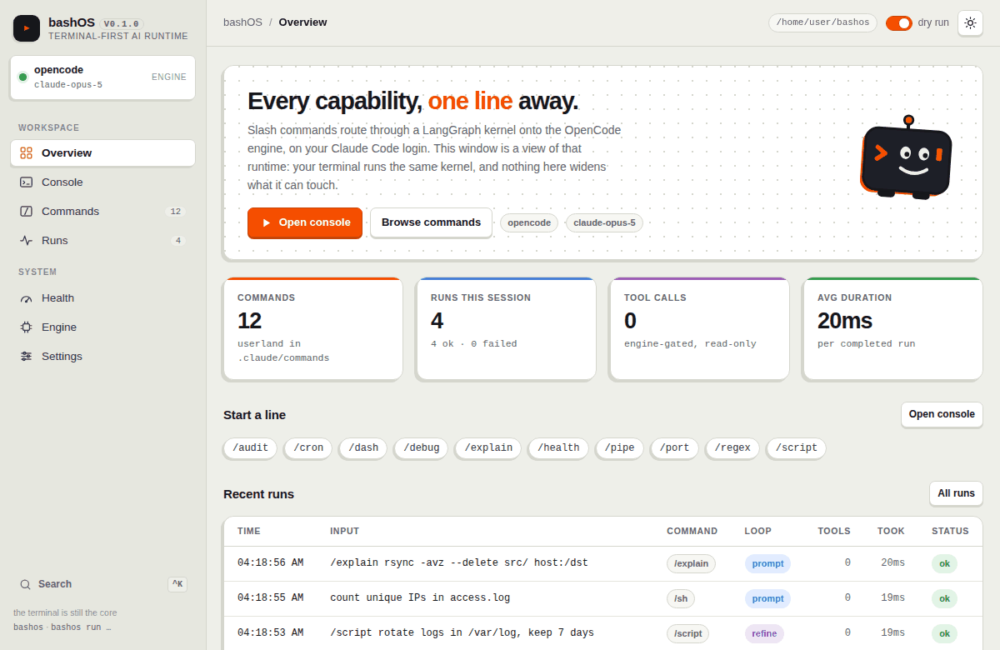

Every image on this page is a real capture of the running app, regenerated by
[`tools/capture_desktop.py`](../tools/capture_desktop.py). The runs in them go
through the **dry-run** path — routing and the rendered prompt, no model call —
which is why they land instantly and need no credentials.

## Opening it

```bash
bashos gui                 # native window if bashos[gui] is installed, else your browser
bashos gui --browser       # skip the window, use the default browser
bashos gui --no-open       # just serve; print the URL
bashos gui --port 7800     # pin the port (default: a free one)
bashos gui -m claude-opus-5   # model override for this window
```

The window opens on a loopback URL carrying a one-time token:

```
serving on http://127.0.0.1:7800
opening in a native window
open it yourself: http://127.0.0.1:7800/?k=Kd3f…
ctrl-c to stop
```

Open that URL yourself to reach the same window from another browser. Without
the token the page shows a **locked** screen rather than any data — the token
lives only in this process and dies with it.

---

## The chrome

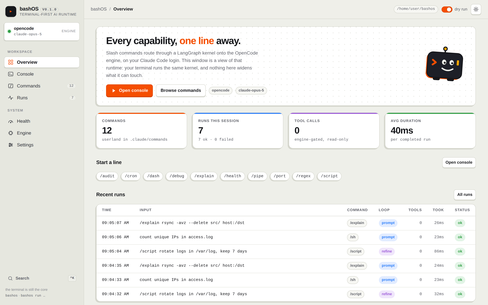

**Sidebar.** Brand with the running version, then the *project card*: the
resolved backend, the model, and a status dot — green on the engine backend,
amber on a completion-only fallback. Clicking it jumps to Engine. Below that,
navigation in two groups — **Workspace** (Overview, Console, Commands, Runs)
and **System** (Health, Engine, Settings) — with live counts for userland and
for this session's runs. The footer holds the search button and a reminder that
the terminal is still the core.

**Top bar.** A breadcrumb for the current scene, the bashOS root this window is
serving, the **dry run** switch, and the theme toggle.

**Dry run** is the switch to know. With it on, every line is routed and its
prompt rendered, but no model is ever called — the fastest way to see *where* a
line goes and *exactly* what would be sent. It is the same `-n` flag
`bashos run` takes, and the same path the test suite uses.

**Routing.** Each scene has its own URL hash (`#/console`, `#/runs/<id>`), so
back/forward work and a run is linkable.

---

## Console — the terminal, as a window

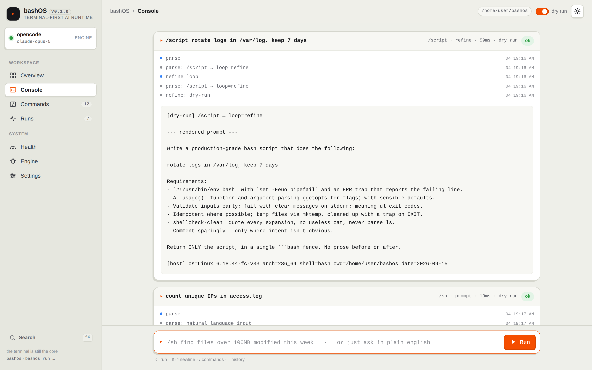

One composer, and everything the kernel does with what you type.

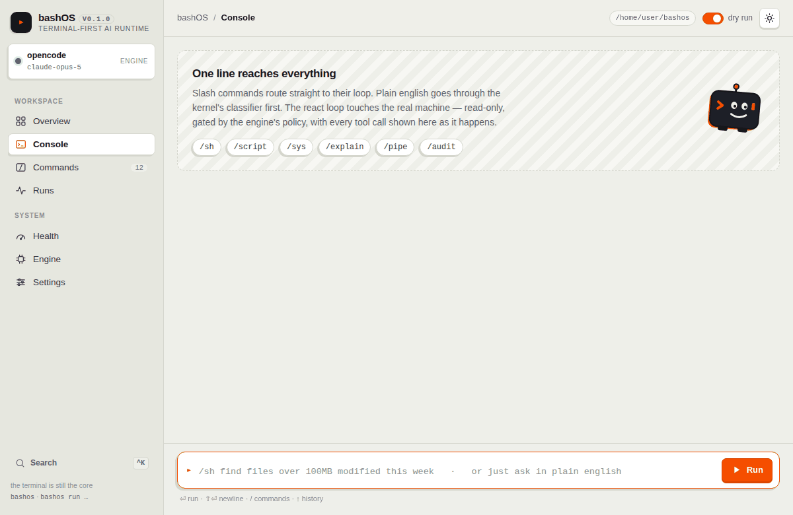

- **Slash completion.** Typing `/` at the start of a line opens the command
  list, filtered as you type, each row showing the command, its loop, its
  description and its argument hint. `↑`/`↓` move, `Tab` or `Enter` accepts,
  `Esc` dismisses.
- **Plain english works too.** A line with no slash goes to the kernel's
  classifier, which picks the best command — the run card shows which one it
  chose and why.
- **Submitting.** `Enter` runs, `Shift+Enter` adds a newline, `↑` on an empty
  composer recalls your previous lines. The composer grows with the text and
  shows the model it will use.
- **The run card.** Your line, a live status pill, and then two things: the
  **activity feed** and the **answer**.

**The activity feed is the kernel narrating itself.** Blue dots are graph nodes
as they complete (`parse`, `classify`, `prompt loop`, `respond`), grey dots are
trace lines the nodes appended, orange dots are **tool calls the engine made**
— streamed as they happen on a `react` run, the same events the REPL prints as
`· read file`. Each carries a timestamp.

**The answer** renders as markdown: headings, lists, tables, blockquotes, and
fenced code blocks with a language label and a copy button. Kernel reports
(`[dry-run] …`, `usage: …`) render verbatim as literal text, exactly as the
terminal prints them.

When a run fails — a bad command name, an engine that will not start — the card
turns red and carries the error the kernel produced, in full.

---

## Commands — userland, browsable

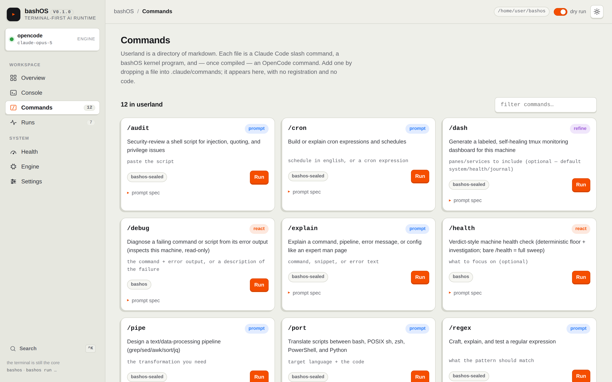

Every file in `.claude/commands/` as a card: the command, its **loop**
(`prompt` blue, `refine` purple, `react` orange), its description, its argument
hint, and the **engine agent** it runs under — `bashos` for the read-only
inspection profile, `bashos-sealed` for no tools at all.

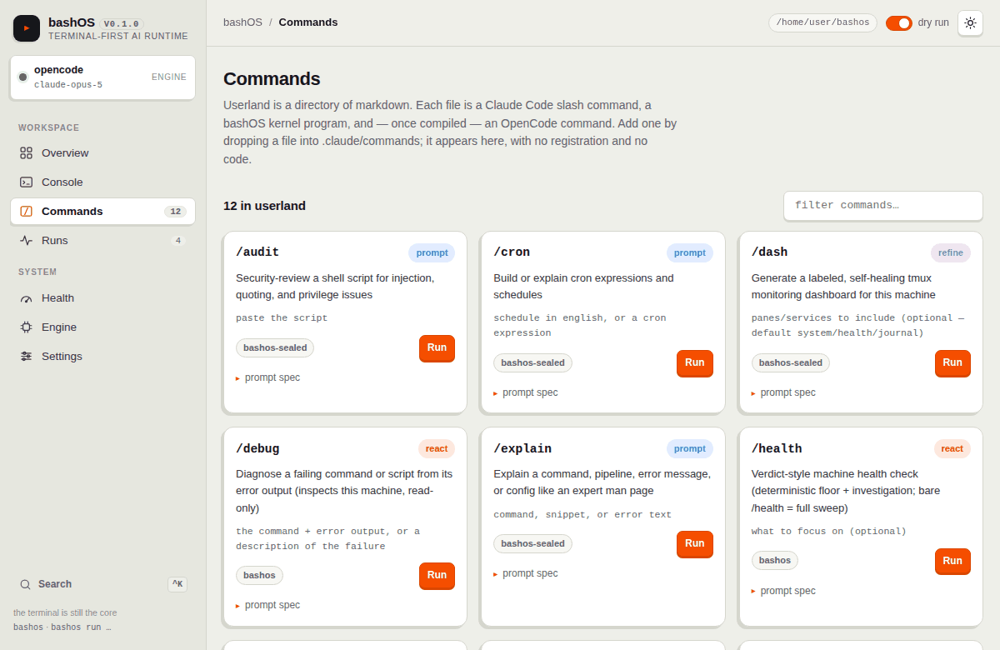

- **Filter** by name or description.
- **Run** jumps to the console with the command prefilled.
- **prompt spec** expands the markdown body that is actually sent, `$ARGUMENTS`
  and all — the same file Claude Code loads as a project slash command.

Drop a new markdown file into `.claude/commands/` and it appears here on the
next load. No registration, no code: the registry is re-read on every request.

---

## Runs — the session, recorded

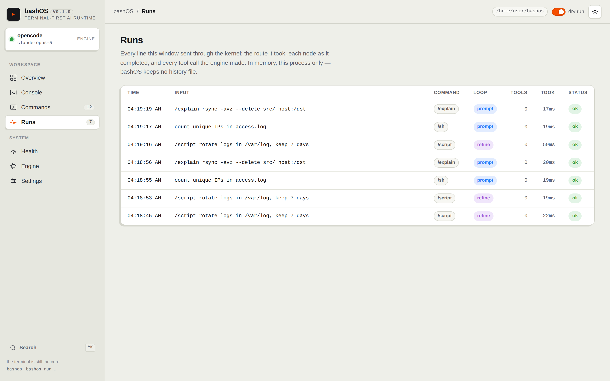

Every line this window sent through the kernel: when it started, what you
typed, which command it resolved to, which loop ran it, how many tool calls the
engine made, how long it took, and how it ended.

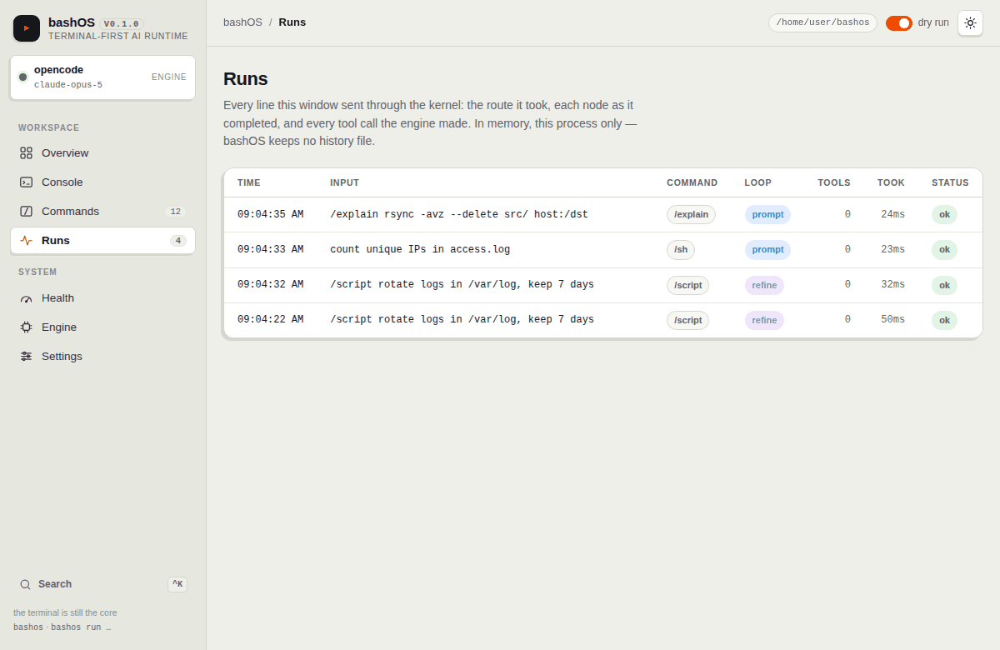

Opening one gives the whole record — run id, route (`slash`, `classified`,
`fallback`, `error`), command, loop, model, dry-run flag, timings, tool-call
count — then the complete kernel activity and the output or the error.

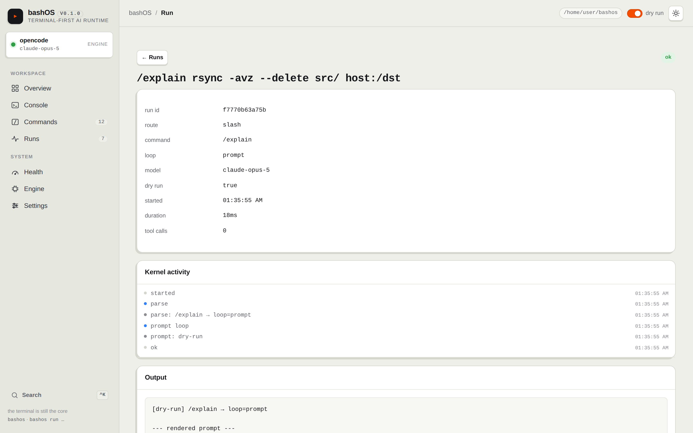

Runs live in memory, in this process, capped at 200. bashOS keeps no history
file and the desktop is not a reason to start one: closing the window is how
you clear it.

---

## Health — the machine, read-only

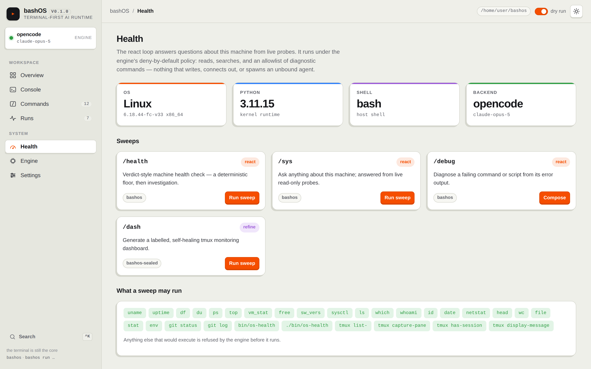

Host facts first: OS and kernel, the Python running the kernel, the shell, and
the resolved backend — the same `[host]` line bashOS appends to every prompt.

**Sweeps** are the react-loop commands, one click away: `/health` (the
verdict-style check — deterministic floor first, then investigation), `/sys`
(anything about this machine, answered from live probes), `/debug` (diagnose a
failure from its error output) and `/dash` (generate a tmux monitoring
dashboard). Commands that need arguments say *Compose* and hand you the console
with the line started; the rest say *Run sweep*.

**What a sweep may run** lists the probe allowlist itself — `uname`, `df`,
`ps`, `netstat`, `git status`, `bin/os-health`, the read-only `tmux` verbs, and
the rest. This is rendered from `opencode/policy.py`, so the page cannot drift
from the policy the engine enforces. Anything not on it is refused by the
engine *before* it executes.

---

## Engine — what bashOS actually runs on

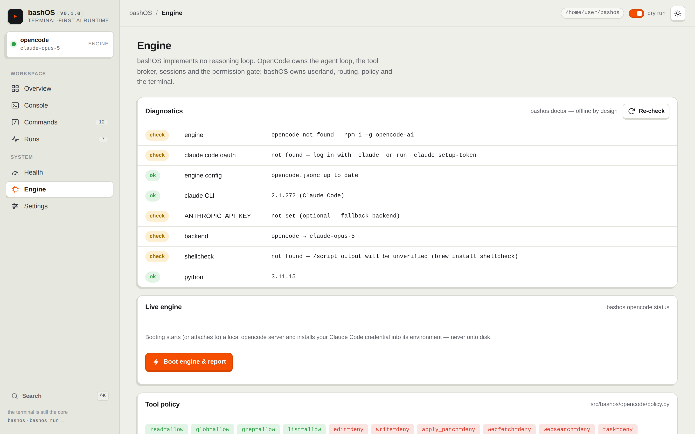

*(These captures were taken in a container with neither `opencode` nor a Claude
Code login installed, so Diagnostics shows the not-found path — what a fresh
machine looks like before setup, and exactly what the terminal would report.)*

- **Diagnostics** is `bashos doctor`, offline by design: the engine binary, the
  Claude Code credential and where it was found, whether `opencode.jsonc` is in
  sync, the `claude` CLI, `ANTHROPIC_API_KEY`, the resolved backend, shellcheck,
  and the Python version. *Re-check* re-runs it. It reports where a credential
  came from — never its value.
- **Live engine** boots (or attaches to) a local `opencode serve`, installs your
  Claude Code credential into its environment, and reports the URL, version,
  auth status, connected providers, config state and loaded agents. This is
  `bashos opencode status` with a button.
- **Tool policy** renders the deny-by-default ruleset as chips: `read=allow`,
  `write=deny`, `webfetch=deny`, `bash:*=deny` followed by each allowed probe.
- **opencode.jsonc** shows whether the generated engine config is in sync with
  the registry, and expands to the file itself.

---

## Settings

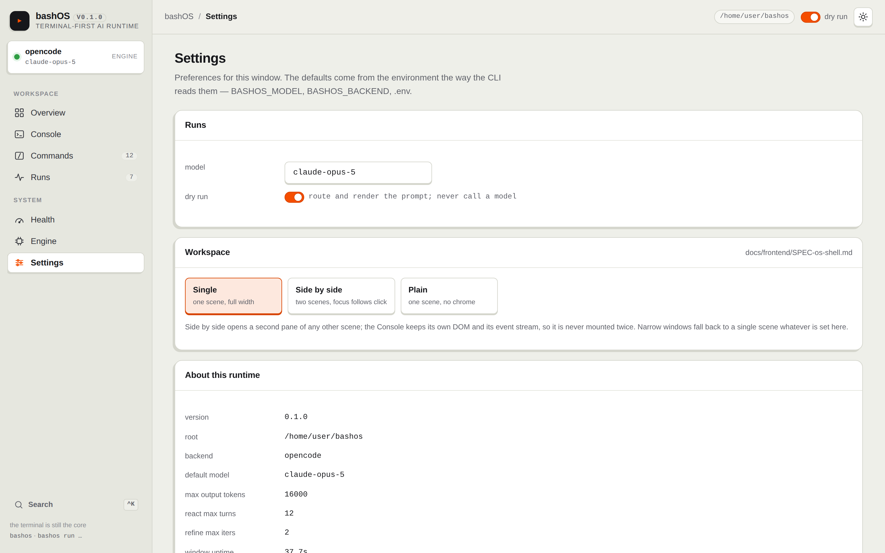

The model this window uses, the dry-run default, and what the runtime actually
resolved to — version, root, backend, token and turn limits, uptime. Defaults
come from the environment exactly as the CLI reads them (`BASHOS_MODEL`,
`BASHOS_BACKEND`, `.env`); changes here apply to this window.

The last card is the point of the whole thing: the terminal is still the core,
and these are the commands that reach the same kernel.

---

## Command palette

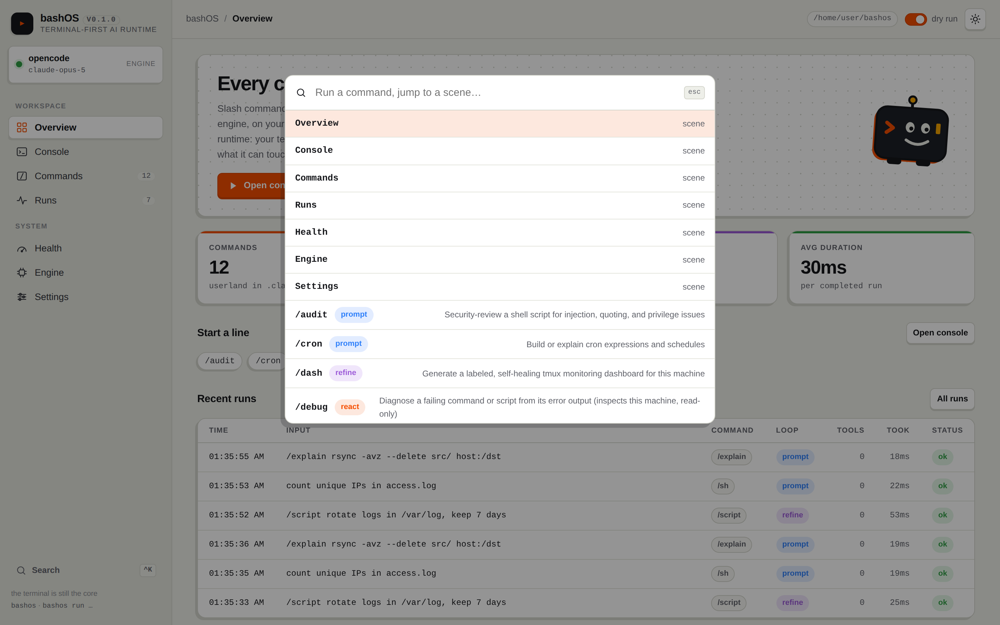

`⌘K` (`Ctrl-K` off macOS) opens a palette over any scene: every scene, every
command in userland, plus *Toggle theme* and *Toggle dry run*. Type to filter,
`↑`/`↓` to move, `Enter` to go. Picking a command lands you in the console with
it prefilled.

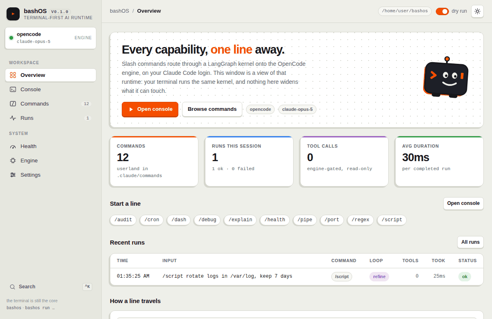

## Light and dark

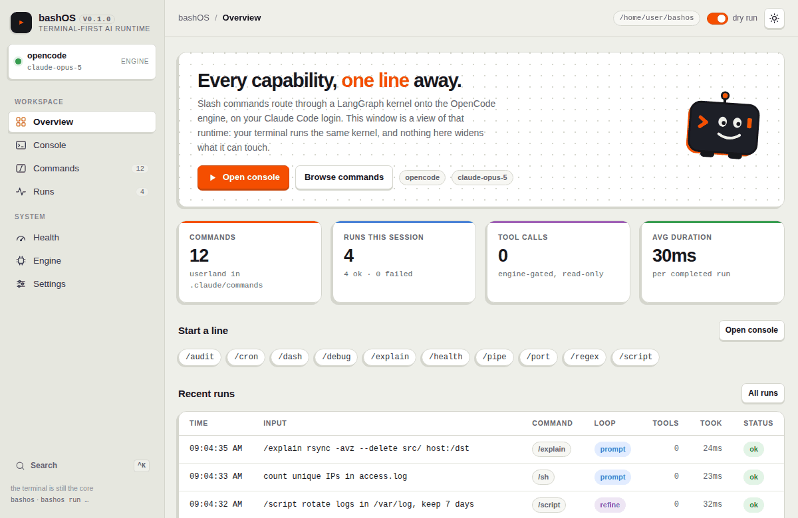

Both themes are defined as CSS custom properties, so every component — cards,
badges, tables, code blocks, the activity feed — follows the toggle. The choice
persists per browser.

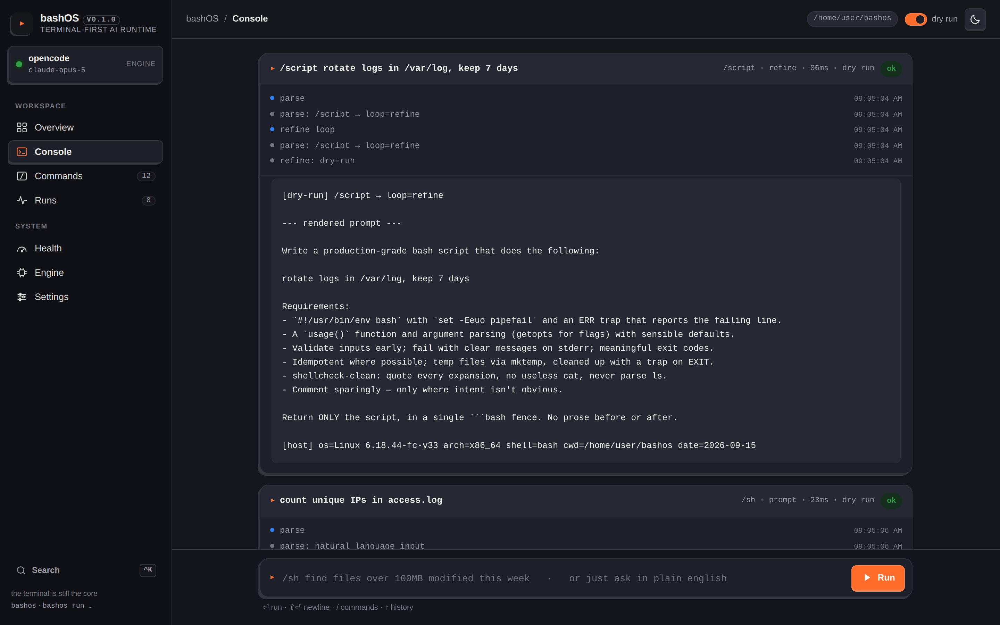

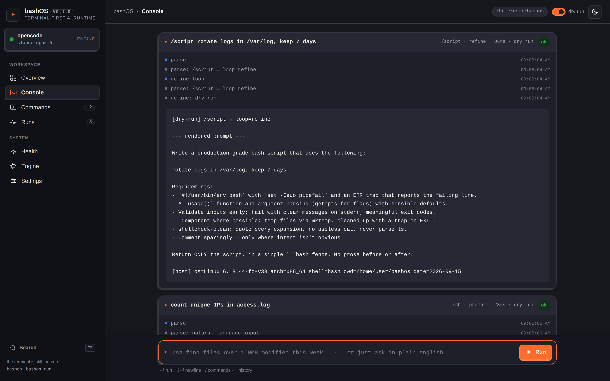

---

## Keyboard

| Keys | Where | What |
|---|---|---|
| `⌘K` / `Ctrl-K` | anywhere | open or close the command palette |
| `Enter` | composer | run the line |
| `Shift+Enter` | composer | newline |
| `/` | start of a line | open command completion |
| `Tab` / `Enter` | completion open | accept the highlighted command |
| `↑` / `↓` | completion or palette | move the selection |
| `↑` | empty composer | recall the previous line |
| `Esc` | completion or palette | dismiss |

---

## What it refuses to do

The window is a view of the runtime, not a second way into the machine.

| Refusal | Why |
|---|---|
| `!ls` returns **403** | shell passthrough stays in your terminal, where it is your own shell by your own keystroke. A local HTTP server that executes arbitrary commands is a different object with a different blast radius. |
| no wider tool policy | `react` runs still pass the deny-by-default gate in `opencode/policy.py`. Health *renders* the allowlist; it cannot extend it. |
| no credential values | diagnostics report the source of a credential, never the secret. Secrets stay in the engine process's environment. |
| no history on disk | runs are in memory, this process only. |
| no reasoning loop | `src/bashos/gui/` dispatches and renders. Anything needing a loop belongs in a kernel loop or the engine. |

And the socket itself is guarded the way the engine's own socket is: bound to
loopback, a per-process token on every `/api/*` call, `Host` pinned to our own
socket (so a DNS-rebound name fails), `Origin` checked when present, a strict
`Content-Security-Policy`, and caps on every input. See
[DESKTOP.md](DESKTOP.md#how-it-is-guarded).

---

## The look

Paper-cream ground, white cards with a hard offset shadow, one loud accent, and
mono for anything the machine said. Chunky bordered buttons that press down,
colour-coded loop badges, allow/deny chips, and a data table that reads like a
product rather than a log. All of it is 700 lines of CSS custom properties in
`gui/web/app.css` — no framework, no preprocessor, no build step.

The desktop has a mascot: **Tty**, a shell with a face — the `▸` prompt is its
nose, the cursor blinks beside it. It turns up in the masthead, the console
hero and empty states.


## Regenerating these captures

```bash
pip install playwright pillow && playwright install chromium
python tools/capture_desktop.py          # writes docs/media/
```

The tool starts `bashos gui` on a private port, drives every scene with a real
browser, records stills and GIFs, and reports any console error the page
produced — so the documentation and the front end cannot drift apart quietly.

## If something is off

| Symptom | Fix |
|---|---|
| "bashOS desktop is locked" | open the URL bashOS printed (it carries the token), or start the desktop again |
| opened in a browser, not a window | `pip install "bashos[gui]"` for the native window; `--browser` forces the browser |
| a run fails with an engine error | the Engine scene says why — usually `opencode` is not installed (`npm i -g opencode-ai`) or there is no Claude Code login |
| port already in use | `bashos gui --port 0` picks a free one |
| the console shows a 403 for `!…` | by design — use your terminal for shell passthrough |
