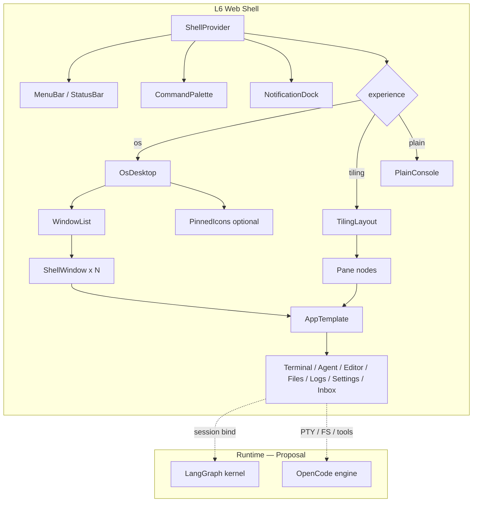

# SPEC: bashOS L6 OS Shell

**Status:** Draft for review  
**Related:** [PRD-os-shell.md](./PRD-os-shell.md), [ROADMAP-os-shell.md](./ROADMAP-os-shell.md)  
**Evidence:** PostHog research brief + live browser tour + **deep interaction pass** (2026-09-15). Proposals labeled **Proposal**.

---

## 1. Scope

Technical specification for an optional L6 **web OS shell**: multi-window / tiling operator console over bashOS runtime sessions. Does not replace CLI/REPL, SSH, or TUI.

---

## 2. Architecture

### 2.1 Layer placement

```
L6 INTERFACE
├── bashos CLI / REPL (existing)
├── SSH / TUI (existing)
└── Web OS Shell (this spec)
      ├── Shell Provider (experience, settings, nav)
      ├── Layout: OsDesktop | TilingLayout | PlainConsole
      ├── Apps (Terminal, Agent, Editor, Files, Logs, Settings, Inbox)
      └── Bridges → runtime  [Proposal]
            ├── LangGraph kernel (runs, graph state, approvals)
            └── OpenCode engine (tools, PTY, workspace FS)
```

### 2.2 Shell component tree (mermaid)



### 2.3 Text tree (parity with PostHog wrap-at-root)

```
ShellRoot
├── ShellProvider          # windows/panes, shellSettings, actions
├── MenuBar / StatusBar    # host, agent count, model, cost  [Proposal: cost feed]
├── LayoutViewport
│   ├── OsDesktop | TilingLayout | PlainConsole
│   └── WindowList | PaneTree → ShellWindow → AppTemplate → App
├── CommandPalette         # Ctrl+K / `/` — global overlay, not a managed window
└── NotificationDock       # toasts; irreversible prompts may deep-link to Inbox
```

**Live PostHog parallel (confirmed):** fixed top taskbar; routes inside rounded AppWindow chrome; `/` → search overlay; `?` chat; `,` display options; Esc closes; maximize/restore/close; **side-by-side panes + focus**; icon context menus (new window / side-by-side / new tab / copy link); toast on color/wallpaper. Deep pass: **free drag/resize unreliable**; minimize not found; several handbook/code shortcuts (`Ctrl+K`, `Shift+Arrow/W/X`, `.`, `|`) failed live — treat free motion as polish risk, side-by-side as Phase 0 goal.

### 2.4 Context split (performance)

Mirror PostHog’s split-context pattern so Terminal/Logs do not re-render on every drag frame:

| Context | Hook | Contents |
|---|---|---|
| Actions | `useShellActions()` | open/close/focus/snap/navigate — stable identity |
| Settings | `useShellSettings()` | `shellSettings`, `experience`, `isNarrow` |
| UI flags | `useShellUI()` | palette open, docks, screensaver-equivalent |
| Windows/panes | `useShellWindows()` / `useShellPanes()` | layout state only |

---

## 3. Window / pane JSON schema

Serializable for deep-links and workspace files. Geometry as **percent of viewport** when persisted (PostHog `?windows=` pattern). Fields `minimized` / free `position`+`size` remain in the schema for Phase 2+; MVP may persist side-by-side / maximized layouts without relying on free drag.

```json
{
  "$schema": "https://bashos.dev/schemas/shell-window-v1.json",
  "schemaVersion": 1,
  "windows": [
    {
      "id": "win_01HZX...",
      "appId": "terminal",
      "title": "pty:agent-17",
      "resourceUri": "pty://session/agent-17",
      "path": "/app/terminal/agent-17",
      "zIndex": 3,
      "minimized": false,
      "expanded": false,
      "snapped": false,
      "position": { "xPct": 5, "yPct": 8 },
      "size": { "wPct": 45, "hPct": 50 },
      "sizeConstraints": {
        "min": { "width": 320, "height": 200 },
        "max": { "width": null, "height": null }
      },
      "fixedSize": false,
      "attribution": {
        "actor": "user:amr",
        "runId": "run_01HZY...",
        "sessionId": "sess_01HZY..."
      },
      "appSettingsKey": "terminal",
      "createdAt": "2026-09-15T02:00:00Z"
    }
  ]
}
```

### 3.1 TypeScript shape (normative for implementers)

```ts
type Experience = 'os' | 'tiling' | 'plain'
type SnapEdge = 'left' | 'right' | false
type NavIntent = 'replace' | 'new' | 'focus' | 'sideBySide'

interface ShellWindow {
  id: string
  appId: AppId
  title: string
  resourceUri: string          // pty:// | agent:// | file:// | log:// | inbox:// | settings://
  path: string                 // deep-link path
  zIndex: number
  minimized: boolean
  expanded: boolean
  snapped: SnapEdge
  position: { xPct: number; yPct: number }
  size: { wPct: number; hPct: number }
  sizeConstraints: {
    min: { width: number; height: number }
    max: { width: number | null; height: number | null }
  }
  fixedSize: boolean
  attribution: {
    actor: string
    runId?: string
    sessionId?: string
  }
  appSettingsKey: string
  createdAt: string            // ISO-8601
}

interface ShellSettings {
  experience: Experience
  colorMode: 'light' | 'dark' | 'system'
  density: 'comfortable' | 'compact'
  performanceBoost: boolean    // reduce motion / wallpaper cost
  reduceTransparency: boolean
  keymapProfile: 'default' | string
  wallpaperId?: string         // Could — optional theme pack
}

interface AppSetting {
  size?: {
    min: { width: number; height: number }
    max?: { width: number; height: number }
    fixed?: boolean
  }
  position?: { center?: boolean }
  modal?: { type: 'standard' | 'side' | 'floating' }
  closeOnEscape?: boolean
  toolbar?: boolean
  hideTitle?: boolean
}
```

**Tiling mode** uses a binary tree of panes instead of free `position`/`size`; persistence schema v1 may store `layoutTree` alongside or instead of `windows` (Phase 2).

---

## 4. Navigation intents

PostHog handbook claimed `newWindow` / focus / replace. Live: **standard nav replaces** the active window; **context menu** “Open in new PostHog window” and “Open in side-by-side view” **work** (deep pass 2026-09-15); code historically lacked an explicit `newWindow` branch in `updatePages` (research brief). bashOS implements intents in the reducer with tests — including `sideBySide` as a **Phase 0/1** consumer, not a docs-only flag.

| Intent | Behavior | Trigger examples |
|---|---|---|
| `replace` | Mutate focused window’s `appId` / `resourceUri` / `path`; preserve others | Default in-app link, address bar submit |
| `new` | **Append** a window/pane; bring to front | Context “Open in new window”, pinned icon open (policy), palette “new …” |
| `focus` | If same `path` or `(appId, resourceUri)` exists → bringToFront only; no duplicate | Second activation of same agent/resource |
| `sideBySide` | Split focused + open target opposite (or as second pane); focus switching; close one → single | Context menu “Open side by side” — **Must** (live-proven) |
| *(browser)* | Open target in a new browser tab (escape hatch) | Context “Open in new browser tab” — Must fallback, not a shell intent enum |

```ts
function navigate(target: { path: string; appId: AppId; resourceUri: string }, intent: NavIntent) {
  // Pseudocode — normative behavior
  const existing = findByPathOrResource(target)
  if (intent === 'focus' || (intent === 'replace' && existing)) {
    if (existing) return bringToFront(existing.id)
  }
  if (intent === 'new' || intent === 'sideBySide') {
    return appendWindow(target, intent === 'sideBySide' ? { snap: 'opposite' } : {})
  }
  return replaceFocused(target)  // intent === 'replace'
}
```

**Hard rule:** Documented intent ⇒ tested consumer. No docs-only flags.

---

## 5. App Template API

### 5.1 Contract

```ts
type AppId =
  | 'terminal'
  | 'agent'
  | 'editor'
  | 'files'
  | 'logs'
  | 'settings'
  | 'inbox'

interface AppTemplateSlots {
  title: ReactNode | string
  toolbar?: ReactNode
  sidebar?: ReactNode
  main: ReactNode
  status?: ReactNode
}

interface AppModule {
  id: AppId
  displayName: string
  icon: string
  defaultSettings: AppSetting
  canOpen: (resourceUri: string) => boolean
  render: (props: {
    windowId: string
    resourceUri: string
    attribution: ShellWindow['attribution']
  }) => AppTemplateSlots
}
```

Shared chrome (HeaderBar analogue): back (if in-window history), address/resource URI, search affordance, window actions. Live PostHog apps (Explorer, Reader, Presentation, changelog timeline) validate that **one chrome + many content shells** scales; bashOS maps metaphors to operator tools (below).

### 5.2 Initial apps

| AppId | Metaphor | Binds to (resource) | Notes |
|---|---|---|---|
| `terminal` | PTY / tmux pane | `pty://session/{id}` | Primary; **Proposal:** OpenCode PTY |
| `agent` | Transcript + tool calls | `agent://run/{id}` | **Proposal:** LangGraph run stream |
| `editor` | Buffer / diff / markdown | `file://{workspace-path}` | Specs + agent-editable buffers |
| `files` | Workspace FS explorer | `files://{root}` | Artifacts + workspace tree |
| `logs` | Trace / structured log | `log://run/{id}` | Attribution & debug |
| `settings` | Display / shell / model | `settings://shell` | Includes `experience` toggle |
| `inbox` | Approvals / human input | `inbox://queue` | Irreversible act gates — **Must** |

Registry: `appSettings: Record<AppId, AppSetting>` keyed by `appId`, not marketing route.

---

## 6. Keyboard map

Ignore when focus is in `INPUT` / `TEXTAREA` / contenteditable / terminal xterm (terminal owns keys when focused).

### 6.1 bashOS core map (normative)

Prefer **live-proven** PostHog behaviors over handbook fiction. bashOS may remap chords for IDE familiarity, but each Must entry needs a tested consumer.

| Shortcut | Action | Mode | Priority |
|---|---|---|---|
| `/` | Open Command Palette / search | all | Must |
| `Esc` | Close palette / modal / overlay | all | Must |
| `Ctrl/Cmd+,` or `,` | Open Settings / display options | all | Must |
| `?` | Agent chat dock **or** shortcuts help (pick one; document) | all | Must (single meaning) |
| Toast on settings change | Non-blocking feedback (theme, wallpaper, etc.) | all | Must |
| `Ctrl/Cmd+Shift+T` | New Terminal | os, tiling | Must |
| `Ctrl/Cmd+Shift+A` | New / focus Agent for current run | os, tiling | Must |
| `Ctrl/Cmd+Shift+I` | Focus Inbox | all | Must |
| `Ctrl/Cmd+W` | Close focused window/pane | os, tiling | Must |
| `Ctrl/Cmd+`` ` | Cycle next window/pane | os, tiling | Should |
| `Ctrl/Cmd+↑` | Maximize / restore | os | Must |
| `Ctrl/Cmd+K` | Open palette (**optional alias**) | all | Should — **do not assume** browser Ctrl+K works; PostHog live: Ctrl+K failed, `/` worked |

### 6.2 PostHog live vs handbook/code drift (do not copy blindly)

| Shortcut | Handbook / code claim | Live deep pass (2026-09-15) |
|---|---|---|
| `/` | Open Spotlight | **Works** |
| `Ctrl/Cmd+K` | Open search | **Did not open** search |
| `?` | Ask Max chat (code) / sometimes “help” in folklore | **Opens chat** |
| `,` | Display options | **Works** |
| `m` | Cycle color mode (code); some docs imply cheatsheet | **Color mode + toast** (not cheatsheet) |
| `\` | Cycle wallpaper (code) | **Works + toast** |
| `\|` | Wallpaper (handbook) | **No effect** |
| `.` | Cheatsheet (handbook) | **No effect** |
| `Shift+←/→` | Snap | **No effect** |
| `Shift+W` / `Shift+X` | Close focused / close all | **No effect** |
| Minimize (`Shift+↓` in code) | Minimize focused | **Minimize UI not found** |

**Hard rule:** Documented shortcut ⇒ tested consumer. Do not ship a cheatsheet that lists non-working keys.

---

## 7. Workspace deep-links

| Form | Example | Behavior |
|---|---|---|
| Single app | `/app/agent/run_01HZY` | `plain` or single focused window |
| Layout restore | `/?windows=<url-encoded JSON>` | Hydrate `ShellWindow[]` from schema v1 |
| Workspace file | `bashos://workspace/{id}` or local `.bashos/workspace.json` | **Proposal:** load layout + resource bindings |
| Experience override | `?experience=plain` | Force mode for automation / embeds |

Shareable layouts are for reproducing multi-agent setups (operator demos), not SEO.

---

## 8. Runtime integration — **Proposal**

No fake existing APIs. Until kernel/OpenCode expose stable contracts, the shell uses adapters behind interfaces:

```ts
/** Proposal — not claimed as shipping API */
interface KernelBridge {
  listRuns(): Promise<RunSummary[]>
  subscribeRun(runId: string): AsyncIterable<RunEvent>
  listApprovals(): Promise<Approval[]>
  resolveApproval(id: string, decision: 'allow' | 'deny', note?: string): Promise<void>
}

/** Proposal */
interface OpenCodeBridge {
  openPty(sessionId: string): PtyHandle
  listWorkspace(path: string): Promise<FsEntry[]>
  readFile(path: string): Promise<Uint8Array | string>
  watchLogs(runId: string): AsyncIterable<LogLine>
}
```

| Concern | Proposal |
|---|---|
| Transport | WebSocket or SSE from local bashOS daemon to web shell |
| Auth | Same-machine first; token for remote later |
| Attribution | Every bridge event carries `actor` + `runId` into window metadata |
| Approvals | Kernel emits approval → Inbox app; UI cannot bypass policy |
| Model list | Settings reads model catalog from kernel; UI remains vendor-agnostic |

Mark any stub with `// Proposal` and feature-flag off by default until Phase 1 bridge spike lands.

---

## 9. Stack recommendation

| Concern | Recommendation | Justification |
|---|---|---|
| App framework | **Vite + React 18** (or 19) | Operator SPA; no Gatsby SSG need; fast HMR for shell iteration |
| Optional SSR | Next only if public docs share the shell later | Avoid premature SSG complexity |
| Styling | Tailwind + `data-experience` / `data-color-mode` | Matches PostHog token approach without CSS-in-JS cost |
| Primitives | Radix UI (menus, dialogs, focus traps) | A11y baseline for chrome |
| Window motion | Phase 0: **side-by-side + maximize** first; optional CSS/Framer free drag later | Deep pass: free drag/resize unreliable on PostHog; side-by-side is the proven multitasking path |
| Terminal | xterm.js | Standard for web PTYs |
| State | React context split (+ optional Zustand for layout tree) | PostHog split-context lesson |
| Search/palette | cmdk or custom over local registry | No Algolia dependency for operator console |
| Test | Playwright (intents, keymap, plain unmount) + Vitest (reducer) | Intent correctness is a Must metric |

**Rejected for MVP:** Gatsby (marketing SSG), Kea (unless already in monorepo), hedgehog-mode packages.

---

## 10. Accessibility, mobile, performance

### 10.1 A11y

- Focus trap in modals and palette; restore focus on close  
- Window chrome: `role="dialog"` or document landmark per window; labeled title  
- `prefers-reduced-motion` ⇒ disable entrance/snap animations; honor `performanceBoost`  
- `plain` mode must be fully usable with keyboard and screen reader (no drag dependency)  
- Inbox approvals: explicit Allow/Deny buttons with confirm for destructive tools  

### 10.2 Mobile / narrow

- `isNarrow` (e.g. `innerWidth < 768`): collapse MenuBar; prefer single pane or force `experience=plain`  
- Do not ship unbroken floating multi-window on small screens (PostHog simplifies taskbar; boring consumer was drifted — we do not repeat that)  

### 10.3 Performance

- Split contexts (§2.4)  
- Virtualize Agent transcripts and Logs  
- Compositor gate while dragging/resizing (skip wallpaper/expensive panes)  
- Budget: 4 windows interactive on mid-tier laptop; document if Framer fails spike  

---

## 11. Live UI evidence → spec decisions

| Live confirmation | Spec decision |
|---|---|
| Wallpaper + icon rails + fixed taskbar | Optional icons in `os`; MenuBar always on in `os`/`tiling` |
| Rounded panels, scrollbars, close, maximize/restore | Must chrome; expand/restore in Phase 1 |
| Replace-on-standard-nav | Default intent = `replace` |
| Multi-pane reader (handbook/blog) | App templates may use sidebar + main + aux columns |
| `/` search + Esc | Palette global overlay |
| Display Options surface | Settings app owns theme/experience/performance |
| Explorer / slides / changelog density | Validates dense apps; map to Files / Agent report / Logs |
| Side-by-side panes + context menus (deep pass) | `sideBySide` + `new` are Must; Phase 0 validates first |
| Free drag/resize unreliable; snap shortcuts no effect; minimize not found | Defer free drag/resize/snap/minimize; don’t block MVP |
| Ctrl+K failed; `/` worked; handbook `.`/`|` failed | Keymap from live truth; note PostHog drift in cheatsheet |
| Boring mode action with no visible change | `plain` requires real unmount consumer |
| No app.posthog.com | Spec ignores product-app auth; local daemon first |

---

## 12. Open questions (spec-level)

1. Does OpenCode already expose a web-consumable PTY protocol, or does L6 need a new adapter? **Proposal until answered.**  
2. Should tiling be the default for terminal users, with `os` as optional skin? (Product: ROADMAP Phase 2.)  
3. Single shared pane-session protocol between TUI and web shell?  
4. Workspace file format: extend existing bashOS project config or new `.bashos/workspace.json`?  
5. Cost/model StatusBar feeds — which kernel metrics are stable?  

---

*End of SPEC.*
